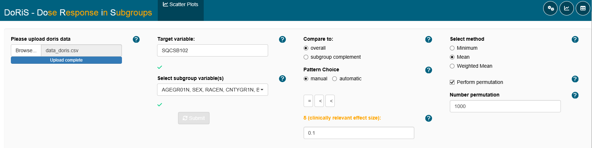
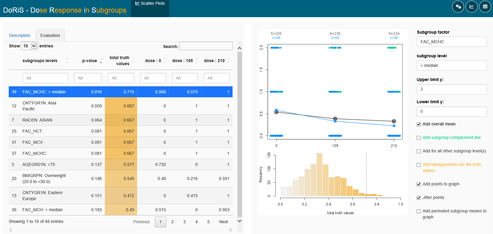

# DoRiS - Dose Response in Subgroups

### Intention
One dose fits all? Not necessarily! There might not always be a single dose 
level that is adequately safe and effective in all patients. For some drugs 
individualized dosing would deliver significantly greater efficacy and/or safety.
For other drugs individualized dosing might even be necessary due to a small
therapeutic window. Individualized dosing can help to improve development 
success rates and competitiveness in clinical use.

### Example 
Imagine a higher dose response in females compared to males which might remain
undetected by focusing on the overall study result.

The DoRiS (Dose Response in Subgroups) application can be used to identify such
subgroups with a dose response that deviates from the remaining study participants. 
Therewith potential subgroups for individualized dosing can be identified.

### How DoRiS works
Consider a dose finding study with three active dose levels and placebo.
In figure 2, the potential dose response curve of a subgroup is 
shown in blue and the dose response curve in of the reference group in green.
The reference group is chosen as the complement of the subgroup here.
For finding a subgroup corresponding with a curve like the blue one, we specify in which pattern of deviation between the two dose response 
curves the user is interested in (Figure 1).

For example: equal – greater – greater – greater means the user is looking for a 
deviating subgroup with equal response after placebo and greater response 
after the active doses. Next, it is specified a clinically meaningful difference 
delta the user is interested in. If the target variable is the change in blood
pressure the user may select a difference of 5 mmHg. 



Figure 1: Identification of subgroups deviating from the overall dose response.


Figure 1 presents a screenshot from the DoRiS application 
showing the main settings, where the user can select a target variable 
and all subgroup defining factors. The other options are basically 
all about the pattern and how to compare the overall data. 
For the example in Figure 3 we selected a ‘manual’ pattern choice, the 
‘subgroup complement’ as reference, the pattern ‘equal – smaller – smaller’,
a clinically meaningful difference of delta=0.1 and a number of ‘1000’ runs for our the permutation test. 


### Fuzzy Logic
Fuzzy logic gives us a truth value for the required difference in each dose 
group to be true. For dose group D3 the truth value for the difference to be 
greater by delta is 1 because the difference is actually greater than delta. 
Same for dose group D2 – here the difference is exactly equal to delta. 
For dose group D1 the difference is only about 70% of delta, so the truth value
is about 0.7. For the placebo group P the difference is almost 0, i.e. the
truth value for being equal is very close to 1. Then a total truth value
for the complete pattern of deviation is determined as the average of the
single truth values weighted by the number of subjects in the dose groups. 

Finally, a permutation test is performed (cf. Fig. 1). 
The subgroup affiliation within the dose groups is shuffled and the total
truth value is calculated for each permutation. The location of the
observed total truth value in the distribution of simulated values is 
then used to identify remarkable subgroups.


Figure 2: Settings to be selected in the DoRiS application.


### What DoRiS provides

When all settings are done and executed the user receives a dashboard 
like in Figure 3. A list of all subgroups sorted by the total truth 
values with the best fitting subgroup at the top can be seen on the 
left side in the DoRiS application. On the right side the dose 
reponse curve for the respective subgroup is displayed together with 
a histogram of the total truth values from the 500 permutations. 
Only very few of the simulated total truth values are larger than the observed 
total truth value in this example – which is presented as a dashed line – which
results in a small p-value of 0.012.

Interesting deviating subgroups can then be further explored 
with the team. Can the exposure data explain the observed deviation? 
Do PK/PD models support the deviation in dose response? Is there any 
literature available describing mechanisms explaining the observed deviation? 



Figure 3: Exemplary results of searching for subgroups deviating from the overall dose response 


## Installation

You can install and load the development version from
[GitHub](https://github.com/) with:

``` r
# install.packages("devtools")
# install.packages("shiny")
# install.packages("shinyWidgets")
# install.packages("bslib")
# install.packages("bsplus")
# install.packages("shinyBS")
# install.packages("DT")
# install.packages("tidyr")
# install.packages("dplyr")
devtools::install_github("https://github.com/hekube/BIC-DoRiS")
library(bsplus)
library(doris)
```

and start the app with:

``` r
#run_doris()
```
